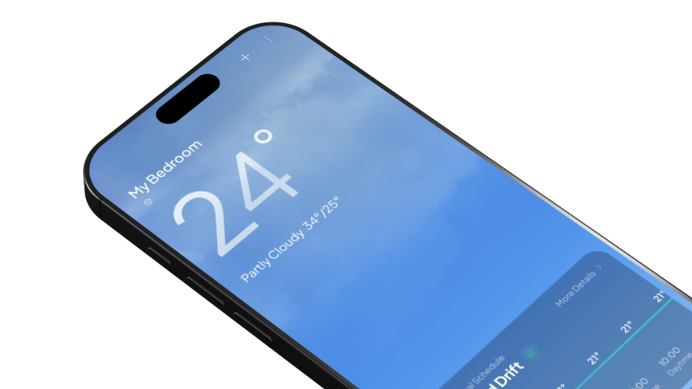

<div align="center">

  

### Turn dumb ACs autonomous with *zero* new hardware. Just your phone.

[](https://github.com/yvliet/klimata/releases/tag/v1.0.0)
[](app)
[](app/src/main/java/com/example/klimata/ui)
[](app/src/main/java/com/example/klimata/data/network/GeminiApiClient.kt)
[](https://open-meteo.com/)
[](https://devpost.com/software/klimata)
[](https://www.youtube.com/watch?v=V4eViWpPb4I)
[](LICENSE)

[Releases](#1-releases--availability) •
[Why Klimata?](#2-why-klimata) •
[How It Works](#3-how-it-works) •
[Hardware & IR Dispatch](#4-hardware--ir-compatibility) •
[Energy & Carbon Math](#5-energy--carbon-savings-math) •
[Developer Quickstart](#6-developer-quickstart) •
[Behind the Build](#7-behind-the-build) •
[License](#8-license)

</div>

## 1. Releases & Availability

Download the latest pre-compiled Android APK:

👉 **[Download Klimata v1.0.0 (APK)](https://github.com/yvliet/klimata/releases/download/v1.0.0/klimata-v1.0.0.apk)** • **[View Release Notes](https://github.com/yvliet/klimata/releases/tag/v1.0.0)**

- **Direct Install**: Download `klimata-v1.0.0.apk` onto your phone, tap to open, and allow installation from unknown sources.
- **Target Architecture**: Universal APK (~2.2 MB, ARM64-v8a, armeabi-v7a, x86_64)
- **Minimum Operating System**: Android 8.0 Oreo (API Level 26) or higher
- **Recommended Hardware**: Any Android phone with a built-in Consumer Infrared (IR) blaster (POCO, Xiaomi, Redmi, Huawei, Vivo, TCL)
- **Devices without an IR Blaster**: Klimata runs in companion mode with full weather sync, thermal load calculations, and manual setpoint controls. Standalone $3 ESP32 Wi-Fi/IR puck firmware is in development for hardware-independent operation.

## 2. Why Klimata?

In tropical regions like Southeast Asia, residential air conditioning accounts for **50% to 60% of monthly household electric utility bills**. 

Most homes run standard non-inverter split AC units. Unlike modern variable-speed inverters that modulate motor speed smoothly, legacy compressors have only two operational states: blasting at 100% full capacity or sitting completely shut off. In practice, this leads to a conventional "flat freeze" where the compressor runs unthrottled for eight hours straight—burning excess electricity and waking you up shivering at 3 AM.

Because old remotes lack intelligent thermal scheduling, people lock their AC setpoint at 18°C or 20°C before going to bed. But overnight, two things happen simultaneously:
- **Outdoor ambient temperatures drop** to their daily baseline trough between 03:00 and 05:00.
- **Human core body temperature slides downward** during deep, slow-wave sleep.

Running an unthrottled compressor all night burns unnecessary kilowatt-hours, runs up expensive electric bills, and causes chronic sleep disruption (waking up freezing at 3:00 AM reaching for extra blankets).

Buying a new inverter AC costs hundreds of dollars, and tossing out a functional legacy appliance creates needless e-waste. Klimata turns the "dumb" AC already bolted to your wall into an autonomous, climate-aware thermal appliance using nothing more than your existing phone, vision AI, and hardware infrared pulses.

## 3. How It Works

### 1. Optical AC Identification (Gemini Vision Pipeline)
Instead of forcing users to scroll through hundreds of obscure 4-digit remote code manuals, Klimata uses Google Gemini multimodal vision:
- Snap a single casual photo of the indoor unit grille, front fascia badge, or rating specification sticker.
- The vision pipeline inspects casing geometry, vent patterns, and manufacturer badges (Sharp, Daikin, Panasonic, Gree, Mitsubishi, LG, Samsung, Midea, TCL, Carrier, Toshiba).
- It extracts the model series, cooling capacity (BTU / PK), and inverter classification, matching them directly to a calibrated infrared transmission profile.
- If network access is unavailable, Klimata gracefully falls back to an offline thermal volume catalog matched to your room dimensions.

### 2. Continuous Dynamic Thermal Sleep Curve
Klimata does not rely on rigid timers. It computes a continuous 24-hour thermodynamic schedule by harmonizing real-time outdoor temperature trajectories (fetched via Open-Meteo) with room thermal mass:

- **21:00 – 23:00 (Nighttime Pre-Cool)**: Target base setpoint (e.g., 24°C) with high fan speed to rapidly strip daytime heat stored inside concrete walls and masonry.
- **00:00 – 02:00 (Metabolic Drift)**: Gradually steps setpoint up (+1°C) to track human circadian metabolic deceleration during deep sleep stages.
- **03:00 – 04:00 (Ambient Trough Sync)**: Steps up to 26°C as outdoor temperatures dip to their coldest nocturnal baseline, eliminating midnight hypothermic chills.
- **05:00 – 06:00 (Thermal Coasting)**: Cuts the compressor power draw to **0 Watts**. Shifts into circulation fan-only mode, coasting on the room's trapped cold air inertia until your wake-up alarm.
- **Daytime Solar & Grid Relief**: Adaptive thermal offsets for midday solar heat spikes (12:00 – 15:00) and evening grid peak demand relief (17:00 – 20:00).

### 3. Zero-Waste Hardware Infrared Dispatch
No Wi-Fi bridges, Tuya hubs, or proprietary smart plugs required. Klimata modulates raw microsecond pulse timings directly through Android's hardware `ConsumerIrManager` at 38 kHz, mimicking your original OEM physical remote down to the exact checksum bits.

### 4. Real-Time Impact & Carbon Ledger
Tracks avoided compressor runtime hours and computes verified energy savings:
- **Kilowatt-hour (kWh) reductions** calculated against rated capacity baselines.
- **Direct utility savings** formatted in local currency (IDR, USD, EUR, etc.).
- **Avoided carbon footprint** calculated using localized grid emission factors ($\text{kg CO}_2\text{e}$ offset, vehicle km avoided, and equivalent tree seedlings).

## 4. Hardware & IR Compatibility

### Tested Phone Transceivers
Klimata interfaces with phones equipped with built-in infrared blasters running Android:
- **POCO**: F-series (F3, F4, F5, F6), X-series (X3, X4, X5, X6 Pro), M-series
- **Xiaomi & Redmi**: Redmi Note 10 / 11 / 12 / 13 / 14 series, Xiaomi 12 / 13 / 14 series
- **Huawei & Honor**: Devices with integrated Consumer IR emitters
- **TCL & Vivo**: Select models with hardware IR blaster support

### Supported OEM Protocol Encoders
Klimata contains low-level pulse-width and pulse-distance encoders built directly into [`IrBlasterService.kt`](app/src/main/java/com/example/klimata/data/ir/IrBlasterService.kt):

| Manufacturer Protocol | Frame Structure | Timing & Modulation Highlights |
| :--- | :--- | :--- |
| **Sharp J-Tech Inverter** | 13 bytes (104 bits) | 38 kHz, 3800µs header, nibble-folded XOR checksum, Plasmacluster flags |
| **Gree / Sharp OEM (YB0F2)** | 8 bytes (67 pulses) | Dual 32-bit blocks separated by a 3-bit footer and a 20ms inter-frame gap |
| **Daikin ARC433 / ARC480** | 19 / 27 bytes | Multi-frame burst with 3500µs leader, parity checksum, comfort airflow |
| **Panasonic DKE / CKP** | 27 bytes | 3500µs mark/space header, nanoe-G toggle, 8-bit additive checksum |
| **Mitsubishi Electric** | 18 bytes (KP3BS) | 3400µs header, vane swing bits, wide-vane thermal steering |
| **LG Dual Inverter** | 4 bytes (28 bits) | 8500µs leader pulse-distance standard with 4-bit nibble sum |
| **Midea / Carrier / Toshiba** | 6 bytes (48 bits) | NEC-style inverted byte validation for OEM split units |

## 5. Energy & Carbon Savings Math

Klimata calculates savings by modeling compressor mechanical duty cycles against room thermal mass retention:

$$\text{Baseline Nightly Consumption (kWh)} = \frac{\text{Rated Watts} \times \text{Hours} \times \text{Duty Cycle (0.74)}}{1000}$$

$$\text{Klimata Modulated Consumption (kWh)} = \frac{(\text{Modulated Watts} \times \text{Active Hours}) + (\text{Fan Watts (30W)} \times \text{Coasting Hours})}{1000}$$

$$\text{Avoided Monthly Emissions} = \Delta \text{kWh}_{\text{saved}} \times 30 \times \text{Grid Emission Factor} \left(\frac{\text{kg CO}_2\text{e}}{\text{kWh}}\right)$$

### Practical Impact Breakdown
- **Rated Compressor Power**: ~380W (0.5 PK), ~840W (1.0 PK non-inverter), ~1520W (2.0 PK)
- **Compressor Cutoff Window**: 1.5 to 2.0 hours of zero-draw fan-only coasting every morning
- **Measurable Result**: **20% to 38% reduction in nightly kWh consumption** (~$5 to $12/month saved per room) without compromising thermal comfort.

## 6. Developer Quickstart

### Prerequisites
- **Android Studio**: Ladybug (2024.2+) or Meerkat (2025.1+)
- **JDK**: Java Development Kit 17 or 21
- **Android SDK**: Compile SDK 37, Min SDK 26 (Android 8.0+)
- **Gemini API Key**: Free API key from [Google AI Studio](https://aistudio.google.com/)

### Build & Run Locally

```bash
# 1. Clone the repository
git clone https://github.com/yvliet/klimata.git
cd klimata

# 2. Configure local properties with your Gemini API Key
echo "gemini.api.key=YOUR_GEMINI_API_KEY_HERE" >> local.properties

# 3. Build debug APK
./gradlew assembleDebug

# 4. Install onto connected phone via ADB
./gradlew installDebug
```

### Key Architecture Components

- **[`ThermalCalculationEngine.kt`](app/src/main/java/com/example/klimata/data/engine/ThermalCalculationEngine.kt)**: Dynamic 24-hour schedule computation and room thermodynamic modeling.
- **[`IrBlasterService.kt`](app/src/main/java/com/example/klimata/data/ir/IrBlasterService.kt)**: Low-level 38 kHz pulse generator and multi-brand OEM protocol encoders.
- **[`GeminiApiClient.kt`](app/src/main/java/com/example/klimata/data/network/GeminiApiClient.kt)**: Multimodal camera vision analysis and AC classification pipeline.
- **[`WeatherApiClient.kt`](app/src/main/java/com/example/klimata/data/network/WeatherApiClient.kt)**: Open-Meteo ambient hourly forecast synchronization.
- **[`KlimataScreen.kt`](app/src/main/java/com/example/klimata/ui/KlimataScreen.kt)**: Jetpack Compose dashboard with atmospheric sky canvas and multi-room pager.

## 7. Behind the Build

> **Submitted to NextStep Hacks 2026** • Built solo by [@yvliet](https://github.com/yvliet) in a high-intensity hackathon sprint.  
> 📺 **Watch the live-action video demo on [YouTube](https://www.youtube.com/watch?v=V4eViWpPb4I)**

### Raw Hackathon Challenges & Lessons Learned

| Challenge | Impact Risk | Engineering & Creative Workaround |
| :--- | :--- | :--- |
| **Identical Generic Shells** | Budget OEM AC brands across Asia share identical white plastic shells while using completely incompatible IR protocols. | Tuned Gemini system prompts to cross-reference badge typography, vent louvers, and model code stickers, paired with a 1-tap interactive test-pulse pairing modal. |
| **The 3:00 AM Camera Reality Check** | Filming a dark 3 AM bedroom on a POCO phone produced muddy, unusable footage that obscured the product. | Ditched the dark-room setup entirely, and did it in the light. |
| **$0 Mockup Paywalls** | Online 3D mockup tools charged steep subscription fees for clean device frames on a zero-dollar budget. | Designed and staged mockups manually. Used CapCut motion blur and snappy 0.2s slide transitions to maintain professional pacing. |
| **Solo Hackathon Scope** | Trying to polish every UI transition risked missing the hard hackathon deadline. | Prioritized the working product: a reliable Gemini vision pipeline, real 38 kHz IR blaster transmission, and real Open-Meteo ambient sync. |

## 8. License

Klimata is open-source software licensed under the **[MIT License](LICENSE)**.
